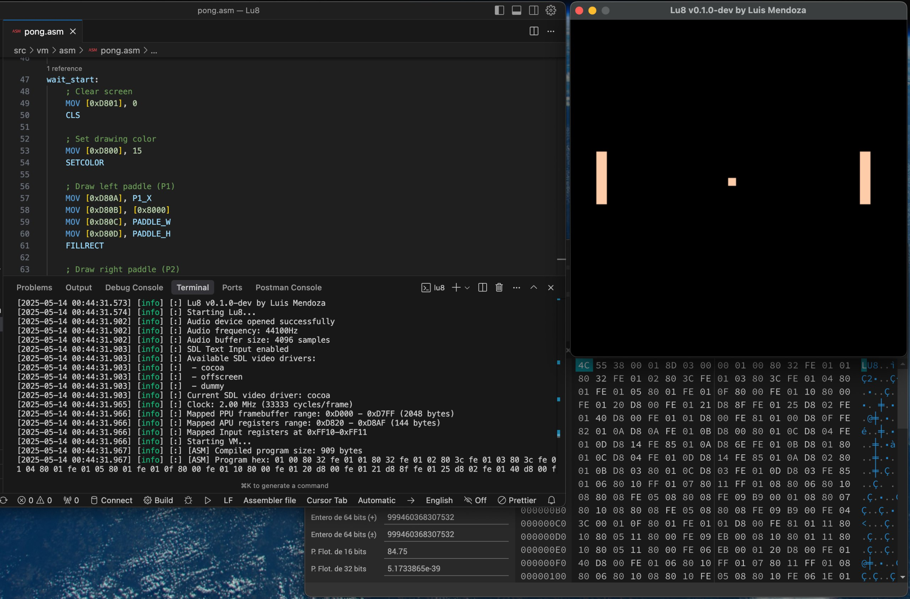

# Lu8 - A Fantasy Retro Virtual Console

Lu8 is a fantasy virtual console I've been building from scratch in C++. It's designed to emulate the feel of an 8-bit homebrew system that never actually existed — but could have. It features a custom VM, a low-level assembly language, and memory-mapped graphics/audio subsystems.

## About the Project

Hi, I'm Luis 👋

Ever since I was a kid, I've been fascinated by how video games work. That curiosity — digging through game files, trying to understand how everything fit together — was the spark that ignited my journey into programming.

After many years building all kinds of tools, apps, games, and systems, I felt called back to the origins: game development. But this time, I went deeper — I challenged myself to build my own console.

Lu8 is my answer to that challenge. It's not an emulator — it's a contained platform that simulates a retro console with its own ecosystem: CPU, RAM, APU, PPU, BIOS, and a handcrafted assembly language.

## Key Features

* **Custom CPU**

  * 8-bit instructions, memory-mapped architecture
  * Instructions: MOV, ADD, SUB, MUL, DIV, AND, OR, JMP, CMP, etc.
  * Call stack support (CALL, RET)
  * Software-based registers (all data in RAM)

* **APU (Audio Processing Unit)**

  * Inspired by the NES sound chip
  * 5 channels: 2 Pulse, Triangle, Noise, and DMC
  * Volume envelope, duty cycle, sweep, frequency, loop modes

* **PPU (Picture Processing Unit)**

  * 128x128 resolution, 16-color palette
  * Pixel, line, rectangle, circle drawing primitives
  * Direct VRAM access with memory-mapped registers

* **Memory Model**

  * 64KB total RAM
  * BIOS, Program Code, Data, Graphics, Stack, I/O registers
  * VRAM and Audio mapped to specific memory regions

* **Input System**

  * 2-player support with NES-style controller layout
  * Memory-mapped input registers
  * Fully documented key bindings

* **Assembler**

  * Two-pass label resolution
  * Support for constants, labels, comments
  * Generates `.room` binary format with custom header

* **Execution**

  * Clocked at 2 MHz
  * 60 FPS sync
  * Supports `VSYNC`, `HALT`, `LOG`, and more

## Current Status

Lu8 is still in **very early development**, but it's functional. I've built a BIOS bootloader, run simple games (like Pong), and implemented a working audio engine with real-time channel control.

I'm currently writing extensive documentation for developers who might want to write games in Lu8 Assembly. If you're curious or want to test early, stay tuned.

## Roadmap

* [x] VM, CPU, RAM system
* [x] PPU with drawing primitives
* [x] APU with 5 audio channels
* [x] Input system
* [x] BIOS and program boot
* [x] `.room` binary format
* [ ] Lua high-level language transpiler
* [ ] Sprite/tile editor
* [ ] IDE integration / devtools
* [ ] Discord or dev community
* [ ] Web-based sandbox player

## How to Follow

Right now, the project is private but I may open up early builds for testers. You can:

* Watch this repo for updates
* Follow me on [Reddit](https://www.reddit.com/user/mrefactor/) (fantasyconsoles / emudev)
* (Coming soon) Discord for project updates and community chat

Thanks for reading — and if you’re building something cool too, keep going. The process itself is the reward.

— Luis

## License

Lu8 is currently a closed-source project.
While the source code is not public at this time, I may open early builds to testers in the future.
Stay tuned for updates and feel free to reach out if you're curious or want to help shape the direction of this console.

---

> *Lu8 is a passion project. It draws inspiration from PICO-8, TIC-80, NES, and other fantasy/hardware consoles, but follows its own philosophy and architecture.*
