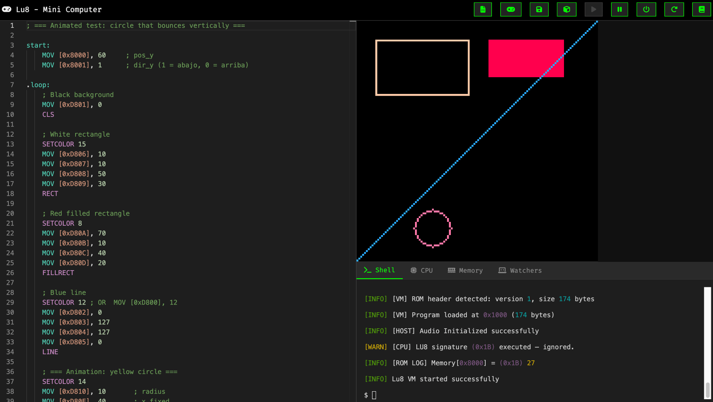

# Lu8 - A Fantasy Retro Virtual Console

**Lu8** is a fantasy virtual console built from scratch in **C++**, with a web-based port in **TypeScript/JavaScript** for easier development and testing. Inspired by systems like the NES, PICO-8, and TIC-80, it simulates a retro 8-bit console that never existed — but could have. It includes its own VM, assembly language, Lua support, and a full browser-based development environment.

You can try the web version at: [https://try.lu8.dev](https://try.lu8.dev)

## About the Project

Hi, I'm Luis 👋

I've always been fascinated by how games work behind the scenes. After years of building tools, games, and automation systems, I decided to go deeper: to create my own fantasy console — not an emulator, but a full ecosystem built from the ground up.

**Lu8** is that project. It's a custom virtual machine with its own instruction set, memory-mapped I/O, sound and video subsystems, and a BIOS bootloader. It runs `.lu8` ROMs written in its own low-level assembly language — and it all runs in the browser.

Today, Lu8 is more than a VM — it's an **all-in-one environment**: you get a code editor, live memory and CPU monitor, integrated shell, and virtual screen, all in one place.

## Key Features

* **Custom CPU**

  * 8-bit instruction set, memory-mapped architecture
  * Core instructions: MOV, ADD, SUB, MUL, DIV, CMP, JMP, CALL, RET, etc.
  * All data operations performed directly in RAM

* **Lua Support**

  * Built-in Lua 5.1 interpreter
  * Support for basic Lua programming constructs
  * Graphics and input functions accessible from Lua
  * Direct integration with the VM's memory and I/O systems

* **APU (Audio Processing Unit)**

  * Inspired by the NES sound system
  * 4+ channels with pulse, noise, and other waveforms
  * Realtime control via memory-mapped audio registers

* **PPU (Picture Processing Unit)**

  * 128x128 resolution
  * 16-color palette with support for custom palettes
  * Drawing primitives: pixels, lines, rectangles, circles, characters
  * Memory-mapped VRAM access

* **Memory Model**

  * 64KB total addressable memory
  * Sections for BIOS, ROM, data, graphics, stack, I/O
  * VRAM and APU mapped into fixed regions

* **Input System**

  * NES-style controller layout for 2 players
  * Key bindings mapped to memory registers
  * Real-time polling from VM

* **Assembler**

  * Custom Lu8 ASM with support for labels, constants, comments
  * Two-pass label resolution and memory validation
  * Outputs `.lu8` binary format with custom header

* **Integrated Development Environment**

  * Web-based code editor
  * Terminal/shell for live commands
  * Real-time RAM and CPU monitoring
  * Integrated VM screen output

## Documentation

To help you get started with Lu8, here's a structured guide to our documentation:

### Core Components
* [CPU](docs/CPU.md) - Understanding the CPU architecture and instruction set
* [Memory](docs/MEMORY.md) - Memory model and RAM organization
* [PPU](docs/PPU.md) - Graphics system and video output
* [APU](docs/APU.md) - Audio processing and sound generation
* [Input](docs/INPUT.md) - Controller input and key mapping

### Development Tools
* [Code Editor](docs/CODE-EDITOR.md) - Using the integrated development environment
* [Terminal](docs/TERMINAL.md) - Working with the virtual console shell
* [Monitor](docs/MONITOR.md) - Debugging and system monitoring
* [Hex-Dump](docs/HEX-DUMP.md) - Inspect the hexadecimal data of a loaded cartridge

### Programming
* [Assembly](docs/ASM.md) - Lu8 assembly language reference
* [Lua](docs/LUA.md) - Lua programming guide for Lu8
* [ROM](docs/ROM.md) - Creating and loading ROM files
* [BIOS](docs/BIOS.md) - System boot process and BIOS functions
* [Palette](docs/PALETTE.md) - Color system and custom palettes

## Current Status

Lu8 is already functional and actively growing. You can boot into a BIOS, write and run programs in Lu8 Assembly or Lua, build games like **Pong**, and hear sound via a real APU. The environment includes a live code editor, virtual shell, and debugging tools.

The project is still under heavy development, but its foundation is solid and extensible.

## Roadmap

### ✅ Done

* VM, CPU, and full RAM system
* PPU with basic drawing support
* APU with 4+ sound channels
* Input system and key mapping
* BIOS and `.lu8` ROM boot
* All-in-One Environment (editor, shell, monitoring)
* Basic Lua support with graphics functions

### 🔧 In Progress / Planned

* Improve BIOS behavior and boot sequence
* Font rendering and character support
* APU improvements (envelopes, better channel control)
* View generated binary hex output
* Better fullscreen mode for Lu8 VM
* Enhanced CPU % usage calculation
* More .ASM and Lua examples and demos
* UI/UX improvements for the dev environment
* IDE/editor enhancements
* Community features (Discord, docs, etc.)

…and more, based on time and feedback.

## How to Follow

Currently, the project is private. If you're interested in testing or contributing, keep an eye on:

* My [Reddit](https://www.reddit.com/user/mrefactor/) (fantasy consoles, emudev)
* (Soon) Discord for testers and dev discussions

Feel free to reach out if you're building something similar or just curious about virtual consoles!

— Luis

## License

**Lu8 is currently closed-source.**
Early builds may be shared for feedback and testing. Stay tuned for updates.

---

> *Lu8 is a retro computing dream brought to life — not an emulator of the past, but a vision of what could have been.*